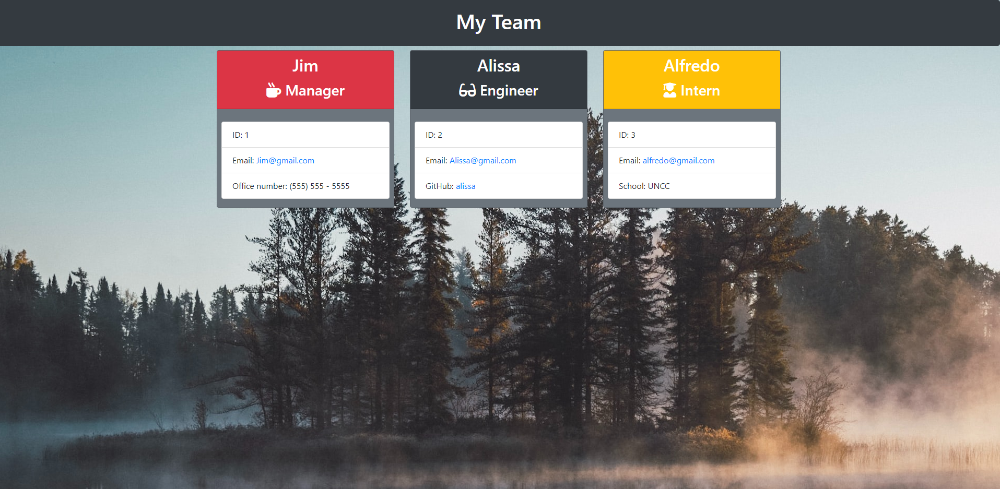

# Team Profile Generator
  A CLS application that allows the user to generate a webpage, displaying the user's engineering team, with details about each member. 
   
  https://github.com/jpbeeson/Team-Profile-Generator
  ## Table of Contents
  * [Demo](#demo)
  * [Installation](#installation)
  * [Testing](#testing)
  * [Developer's Information](#devInfo)
  * [Credientials](#credientials)
  * [License](#license)
  
  ## Demo
  Tutorial Video: https://youtu.be/JWTXfW0fUBA
   
  After installing the required dependencies, you may start the CLS application by typing 'node app.js' into the terminal.
   
  You will be prompted with questions regarding your team. Once you have finished inputting all of your information, you will select no when asked if you would like to add more employees.
  
   
  After selecting no, the application will formulate a team for you in the output folder, in the file 'team.html'. Your webpage will look similar to the screenshot below:
  

  ## Installation

  To run this program, node.js (https://nodejs.org/en/) and inquirer (https://www.npmjs.com/package/inquirer) must be installed. Jest is also installed to run tests.

  ## Testing
  Testing is completed using jest (https://jestjs.io/docs/en/getting-started), and can be ran in the terminal with 'npm run test'.

  ## Developer's Information
  Feel free to contact me using the information below if you have any questions or feedback!
   
  Name: Jacob Beeson
   
  Github Link: <https://github.com/jpbeeson>
   
  Email: <beeson.jp@gmail.com>
  
  ## Credientials
  I utilized the following websites to help build this application: 

https://www.npmjs.com/package/inquirer

https://github.com/SBoudrias/Inquirer.js/blob/master/packages/inquirer/examples/when.js

https://developer.mozilla.org/en-US/docs/Web/JavaScript/Reference/Classes/constructor

https://developer.mozilla.org/en-US/docs/Web/JavaScript/Reference/Operators/super

https://www.w3schools.com/jsref/tryit.asp?filename=tryjsref_class_extends

https://www.w3schools.com/jsref/jsref_class_extends.asp

https://www.w3schools.com/js/js_object_constructors.asp

https://javascript.info/constructor-new

https://www.programmersought.com/article/83745002828/

https://unsplash.com/photos/P8PlK2nGwqA

https://getbootstrap.com/docs/4.1/getting-started/introduction/

  ## License
MIT License

Copyright (c) [2020] [Jacob Beeson]

Permission is hereby granted, free of charge, to any person obtaining a copy
of this software and associated documentation files (the "Software"), to deal
in the Software without restriction, including without limitation the rights
to use, copy, modify, merge, publish, distribute, sublicense, and/or sell
copies of the Software, and to permit persons to whom the Software is
furnished to do so, subject to the following conditions:

The above copyright notice and this permission notice shall be included in all
copies or substantial portions of the Software.

THE SOFTWARE IS PROVIDED "AS IS", WITHOUT WARRANTY OF ANY KIND, EXPRESS OR
IMPLIED, INCLUDING BUT NOT LIMITED TO THE WARRANTIES OF MERCHANTABILITY,
FITNESS FOR A PARTICULAR PURPOSE AND NONINFRINGEMENT. IN NO EVENT SHALL THE
AUTHORS OR COPYRIGHT HOLDERS BE LIABLE FOR ANY CLAIM, DAMAGES OR OTHER
LIABILITY, WHETHER IN AN ACTION OF CONTRACT, TORT OR OTHERWISE, ARISING FROM,
OUT OF OR IN CONNECTION WITH THE SOFTWARE OR THE USE OR OTHER DEALINGS IN THE
SOFTWARE.
